# Implementation Plans — Spring2Fast Pipeline

> [!IMPORTANT]
> These plans are **generic improvements** — they fix systemic weaknesses in the pipeline that would affect ANY Java project, not just the Event Management Portal test case.

---

## Plan 1: Artifact Enrichment — Make Artifacts Complete & Usable

### Problem Statement

The pipeline generates 7 artifacts (02–08), but two critical gaps cause downstream failures:

1. **No class hierarchy data** → model converter doesn't know `Student extends User` → child models get no PK → app crashes
2. **No dependency call-flow** → controllers reference `get_db`/`get_current_user` but nobody scaffolds them
3. **No enum extraction** → Java enums like `UserRole`, `EventStatus` become string literals, losing type safety
4. **Architecture artifact is useless** — says "dependencies: none" for controllers that all call `EventPortalService`
5. **Migration plan is generic** — no per-component conversion instructions

### Files to Modify

| File | Change Type |
|------|-------------|
| [component_discovery_service.py](file:///c:/Users/Musharraf/Documents/Gen-AI/spring2fast/app/services/component_discovery_service.py) | Extend discovery |
| [discover_components.py](file:///c:/Users/Musharraf/Documents/Gen-AI/spring2fast/app/agents/nodes/discover_components.py) | Generate new artifacts |
| [planning_llm_enricher.py](file:///c:/Users/Musharraf/Documents/Gen-AI/spring2fast/app/services/planning_llm_enricher.py) | Richer prompt |
| [state.py](file:///c:/Users/Musharraf/Documents/Gen-AI/spring2fast/app/agents/state.py) | New state fields |

---

### Task 1.1: Extract Enums as a New Component Category

**File:** `component_discovery_service.py`  
**Where:** `CATEGORY_RULES` dict (line 32) and `_classify_component` method (line 143)

Add `"enums"` as a new category alongside entities, services, etc.

```diff
  CATEGORY_RULES = {
      "controllers": ["@RestController", "@Controller"],
      "services": ["@Service"],
      "repositories": ["@Repository"],
      "entities": ["@Entity"],
+     "enums": [],  # Classified by kind=enum in _classify_component
      "dtos": ["dto"],
      ...
  }
```

**In `_classify_component`**, add early detection for Java enums:

```python
# At the top of _classify_component, before annotation checks:
if re.search(r'\benum\s+[A-Z]\w+\s*\{', text):
    return "enums"
```

**In `_extract_structure`**, add enum value extraction:

```python
def _extract_enum_values(self, text: str) -> list[str]:
    """Extract enum constant names from Java enum source."""
    values = []
    # Match the enum body between { and the first ; or method
    enum_body = re.search(r'enum\s+\w+[^{]*\{([^}]+)', text)
    if enum_body:
        body = enum_body.group(1)
        # Split on commas, strip, take names before any parentheses
        for part in body.split(','):
            part = part.strip()
            if part and part[0].isupper():
                name = re.match(r'([A-Z_0-9]+)', part)
                if name:
                    values.append(name.group(1))
    return values
```

Add `enum_values` to `component_payload` when category is `"enums"`.

---

### Task 1.2: Extract `@Table(name=...)` and `@Inheritance` from Entities

**File:** `component_discovery_service.py`  
**Where:** Inside the main loop in `discover()` (around line 94), extend `component_payload`

```python
def _extract_table_name(self, text: str) -> str | None:
    """Extract explicit @Table(name=...) value."""
    match = re.search(r'@Table\s*\(\s*name\s*=\s*"([^"]+)"', text)
    return match.group(1) if match else None

def _extract_inheritance_strategy(self, text: str) -> str | None:
    """Extract @Inheritance strategy if present."""
    match = re.search(
        r'@Inheritance\s*\(\s*strategy\s*=\s*InheritanceType\.(\w+)',
        text,
    )
    return match.group(1) if match else None
```

Add these to the component payload for entities:

```python
component_payload = {
    ...
    "table_name": self._extract_table_name(text) if category == "entities" else None,
    "inheritance_strategy": self._extract_inheritance_strategy(text) if category == "entities" else None,
    "enum_values": self._extract_enum_values(text) if category == "enums" else [],
}
```

---

### Task 1.3: Extract Controller→Service Dependencies

**File:** `component_discovery_service.py`  
**Where:** New method + extend component payload for controllers

```python
def _extract_injected_dependencies(self, text: str) -> list[dict[str, str]]:
    """Extract @Autowired / constructor-injected fields."""
    deps = []
    for field in self.FIELD_PATTERN.finditer(text):
        field_type = field.group(2).strip()
        field_name = field.group(3).strip()
        # Check if it's a service/repo injection (not primitive)
        if field_type[0].isupper() and field_type not in (
            'String', 'Long', 'Integer', 'Boolean', 'List', 'Map', 'Set'
        ):
            deps.append({"name": field_name, "type": field_type})
    return deps

def _extract_service_method_calls(self, text: str, service_names: set[str]) -> list[str]:
    """Extract which service methods a controller calls."""
    calls = set()
    for svc_name in service_names:
        # Match patterns like: eventPortalService.login(...) or service.createEvent(...)
        snake_variants = [
            svc_name[0].lower() + svc_name[1:],  # camelCase
        ]
        for var in snake_variants:
            pattern = re.compile(rf'{var}\.(\w+)\s*\(')
            for match in pattern.finditer(text):
                calls.add(match.group(1))
    return sorted(calls)
```

Add to controller component payloads:

```python
if category == "controllers":
    service_names = {str(s["class_name"]) for s in components.get("services", [])}
    component_payload["dependencies"] = self._extract_injected_dependencies(text)
    component_payload["service_calls"] = self._extract_service_method_calls(
        text, service_names
    )
```

---

### Task 1.4: Generate New Artifact `03b-class-hierarchy-db-schema.md`

**File:** `discover_components.py`  
**Where:** After the existing discovery call (line 18), add a new generation step

```python
def _generate_class_hierarchy_artifact(
    components: dict, artifacts_dir: str
) -> None:
    """Generate 03b-class-hierarchy-db-schema.md."""
    lines = ["# Class Hierarchy & Database Schema", ""]

    # ── Inheritance Trees ──
    lines.append("## Inheritance Chains")
    entities = components.get("entities", [])
    for entity in entities:
        chain = entity.get("superclass_chain", [])
        if chain:
            extends = entity.get("extends", "")
            lines.append(
                f"- **{entity['class_name']}** extends `{extends}` "
                f"(chain: {' → '.join(chain)} → {entity['class_name']})"
            )
            # List inherited fields
            inherited = entity.get("inherited_fields", [])
            for f in inherited:
                annotations = [a.get("name","") for a in f.get("annotations",[])]
                pk = " [PK]" if "Id" in annotations else ""
                lines.append(f"  - inherited: `{f['name']}`: {f['type']}{pk}")
    lines.append("")

    # ── Enum Definitions ──
    lines.append("## Enums")
    enums = components.get("enums", [])
    if enums:
        lines.append("| Enum | Values | Source File |")
        lines.append("|------|--------|------------|")
        for e in enums:
            values = ", ".join(e.get("enum_values", []))
            lines.append(f"| {e['class_name']} | {values} | {e['file_path']} |")
    else:
        lines.append("- none discovered")
    lines.append("")

    # ── Database Table Map ──
    lines.append("## Database Tables")
    lines.append("| Entity | Table Name | PK Field | Inheritance | FK References |")
    lines.append("|--------|-----------|----------|-------------|---------------|")
    for entity in entities:
        table = entity.get("table_name") or _default_table_name(entity["class_name"])
        pk = _find_pk_field(entity)
        inheritance = entity.get("inheritance_strategy") or "none"
        fks = _find_fk_references(entity)
        lines.append(f"| {entity['class_name']} | {table} | {pk} | {inheritance} | {fks} |")
    lines.append("")

    # ── Transversal Dependencies ──
    lines.append("## Shared Dependencies (needed by all endpoints)")
    lines.append("- `get_db` — async database session factory (must be in `app/db/session.py`)")
    controllers = components.get("controllers", [])
    uses_auth = any(
        "HttpSession" in str(c.get("methods", [])) or
        "session" in str(c.get("fields", [])).lower()
        for c in controllers
    )
    if uses_auth:
        lines.append("- `get_current_user` — auth dependency (must be in `app/core/security.py`)")

    artifact_path = Path(artifacts_dir) / "03b-class-hierarchy-db-schema.md"
    artifact_path.write_text("\n".join(lines), encoding="utf-8")
```

---

### Task 1.5: Generate New Artifact `04b-call-flow-graph.md`

**File:** `discover_components.py`  
**Where:** After 03b generation

```python
def _generate_call_flow_artifact(
    components: dict, artifacts_dir: str
) -> None:
    """Generate 04b-call-flow-graph.md."""
    lines = ["# Call Flow & Dependency Graph", ""]

    # ── Controller → Service mapping ──
    lines.append("## Controller → Service → Repository Chain")
    lines.append("| Controller | Method | HTTP | Route | Calls Service Method |")
    lines.append("|-----------|--------|------|-------|---------------------|")

    for ctrl in components.get("controllers", []):
        deps = ctrl.get("dependencies", [])
        service_calls = ctrl.get("service_calls", [])
        methods = ctrl.get("method_details", [])
        for method in methods:
            name = method.get("name", "")
            mappings = method.get("mapping_annotations", [])
            http_method = "GET"
            route = "/"
            for m in mappings:
                if "Post" in m: http_method = "POST"
                elif "Put" in m: http_method = "PUT"
                elif "Delete" in m: http_method = "DELETE"
                route_match = re.search(r'"([^"]+)"', m)
                if route_match: route = route_match.group(1)
            # Which service methods does this controller method probably call?
            relevant_calls = ", ".join(service_calls[:3]) or "—"
            lines.append(
                f"| {ctrl['class_name']} | {name} | {http_method} | {route} | {relevant_calls} |"
            )
    lines.append("")

    # ── Service → Repository mapping ──
    lines.append("## Service Dependencies")
    for svc in components.get("services", []):
        deps = svc.get("dependencies", svc.get("fields", []))
        dep_names = [f"`{d.get('type', d.get('name',''))}`" for d in deps if isinstance(d, dict)]
        lines.append(f"- **{svc['class_name']}** → {', '.join(dep_names) or 'none'}")

    artifact_path = Path(artifacts_dir) / "04b-call-flow-graph.md"
    artifact_path.write_text("\n".join(lines), encoding="utf-8")
```

---

### Task 1.6: Store New Data in `MigrationState`

**File:** `state.py` — add new fields:

```python
class_hierarchy: Annotated[dict, _merge_dicts]  # 03b artifact data
call_flow_graph: Annotated[dict, _merge_dicts]  # 04b artifact data
```

**File:** `discover_components.py` — set them:

```python
next_state["class_hierarchy"] = _build_class_hierarchy_dict(result.components)
next_state["call_flow_graph"] = _build_call_flow_dict(result.components)
```

---

### Task 1.7: Enrich Migration Plan with Full Context

**File:** `planning_llm_enricher.py` — update `enrich()` signature and prompt:

```diff
  async def enrich(
      self,
      *,
      discovered_technologies: list[str],
      business_rules: list[str],
      docs_references: list[dict[str, str]],
      target_files: list[str],
+     component_inventory: dict | None = None,
+     class_hierarchy: dict | None = None,
  ) -> dict[str, Any]:
```

```diff
  prompt = (
      "You are refining a migration plan from Spring Boot to FastAPI.\n"
-     "Return strict JSON with keys: implementation_steps, risk_items, target_files.\n"
+     "Return strict JSON with keys: implementation_steps, risk_items, "
+     "target_files, per_component_notes.\n"
      "Only suggest backend-related items. Exclude frontend/template migration.\n\n"
      f"Discovered technologies: {discovered_technologies}\n"
      f"Business rules: {business_rules[:20]}\n"
+     f"Component inventory summary: {_summarize_inventory(component_inventory)}\n"
+     f"Class hierarchy: {class_hierarchy}\n"
      f"Docs references: {docs_references[:10]}\n"
      f"Current target files: {target_files}\n"
+     "\nFor per_component_notes, provide a dict mapping class_name to a short note "
+     "on how to convert it (e.g. 'inherits PK from User, replicate id field', "
+     "'generate Python Enum with values ADMIN/STUDENT/ORGANIZER', etc).\n"
  )
```

**File:** `migration_planning_service.py` — pass inventory + hierarchy to the enricher, store `per_component_notes` in state.

---

### Task 1.8: Feed 03b to Converter Agents

**File:** `model_converter.py` — add class hierarchy context to the LLM prompt:

```diff
  def _build_llm_prompt(self, *, java_source, contract, existing_code,
-                        discovered_technologies, docs_context, component):
+                        discovered_technologies, docs_context, component):
      ...
+     # Add explicit table name and inheritance info  
+     table_name = component.get("table_name") or ""
+     inheritance = component.get("inheritance_strategy") or ""
+     extends = component.get("extends") or ""
+     
+     table_hint = ""
+     if table_name:
+         table_hint = f"\nEXPLICIT TABLE NAME: {table_name} (use this exactly in __tablename__)"
+     if extends:
+         table_hint += f"\nINHERITANCE: This class extends {extends}. You MUST include ALL inherited fields, especially the primary key `id`."
+     if inheritance:
+         table_hint += f"\nJPA STRATEGY: {inheritance}"
      
      return template.replace(
          "{java_source}", java_source
+     ).replace(
+         "{table_hint}", table_hint
      ).replace(
          "{inherited_fields}", inherited_text
      ...
```

Update `synthesize_model.md` prompt to include `{table_hint}` placeholder.

---

### Acceptance Criteria for Plan 1

- [ ] `03-component-inventory.md` includes enums, `@Table` names, inheritance strategies, and controller dependencies
- [ ] `03b-class-hierarchy-db-schema.md` is generated with inheritance trees, enum definitions, table map, and shared dependencies
- [ ] `04b-call-flow-graph.md` is generated with controller→service→repo call chains
- [ ] `07-migration-plan.md` includes per-component conversion notes
- [ ] Model converter prompt includes table name and inheritance hints
- [ ] All changes work for ANY Spring Boot project (not just Event Management Portal)

---

## Plan 2: Runtime Validation with LLM Auto-Fix Loop

### Problem Statement

The current validation pipeline catches surface issues (syntax, lint, imports) but never checks if the generated app **actually runs**. Two simple commands would catch 90% of real failures:

```bash
python -c "import app.main"          # Does the app even import?
pytest -q                             # Do basic tests pass?
```

Adding these as validation checks + an LLM auto-fix loop would allow the pipeline to self-heal runtime errors.

### Files to Modify

| File | Change Type |
|------|-------------|
| [validation_service.py](file:///c:/Users/Musharraf/Documents/Gen-AI/spring2fast/app/services/validation_service.py) | Add 3 new checks |
| [validate.py](file:///c:/Users/Musharraf/Documents/Gen-AI/spring2fast/app/agents/nodes/validate.py) | Add auto-fix loop |
| [graph.py](file:///c:/Users/Musharraf/Documents/Gen-AI/spring2fast/app/agents/graph.py) | Wire fix loop |

---

### Task 2.1: Add Check 7 — Model Structural Sanity

**File:** `validation_service.py`  
**Where:** After Check 4 (structural integrity), add a new check

This catches missing PKs, bad table names, and missing inherited fields **before** trying to import.

```python
def _check_model_sanity(self, output_dir: Path) -> list[str]:
    """Check that every SQLAlchemy model has a primary key and valid tablename."""
    errors: list[str] = []
    models_dir = output_dir / "app" / "models"
    if not models_dir.exists():
        return errors

    for py_file in models_dir.glob("*.py"):
        if py_file.stem == "__init__":
            continue
        try:
            source = py_file.read_text(encoding="utf-8", errors="ignore")
            tree = ast.parse(source)
        except SyntaxError:
            continue

        for node in ast.walk(tree):
            if not isinstance(node, ast.ClassDef):
                continue
            # Check if it inherits from Base
            inherits_base = any(
                (isinstance(b, ast.Name) and b.id == "Base") or
                (isinstance(b, ast.Attribute) and b.attr == "Base")
                for b in node.bases
            )
            if not inherits_base:
                continue

            # Check 7a: Has primary_key=True somewhere
            has_pk = "primary_key=True" in source or "primary_key = True" in source
            if not has_pk:
                errors.append(
                    f"[MODEL] {py_file.name}: class {node.name} has no "
                    f"primary_key column — SQLAlchemy will crash at import"
                )

            # Check 7b: __tablename__ doesn't contain project/app name fragments
            for stmt in node.body:
                if (isinstance(stmt, ast.Assign) and
                    any(isinstance(t, ast.Name) and t.id == "__tablename__"
                        for t in stmt.targets)):
                    if isinstance(stmt.value, ast.Constant):
                        tbl = str(stmt.value.value)
                        # Flag suspicious table names
                        suspicious = ["portal", "management", "system", "application", "project"]
                        for s in suspicious:
                            if s in tbl.lower() and s not in node.name.lower():
                                errors.append(
                                    f"[MODEL] {py_file.name}: __tablename__ = '{tbl}' "
                                    f"looks like a hallucinated name (contains '{s}')"
                                )
    return errors
```

Wire it into `validate()`:

```python
# ── Check 7: Model structural sanity ──
model_errors = self._check_model_sanity(output_root)
checks["model_sanity"] = len(model_errors) == 0
all_errors.extend(model_errors)
```

---

### Task 2.2: Add Check 8 — Import Smoke Test (`python -c "import app.main"`)

**File:** `validation_service.py`

```python
def _check_import_smoke(self, output_dir: Path) -> list[str]:
    """Try to import app.main and capture any ImportError/RuntimeError."""
    errors: list[str] = []
    try:
        result = subprocess.run(
            [sys.executable, "-c", "import app.main"],
            capture_output=True,
            text=True,
            timeout=30,
            cwd=str(output_dir),
            env={**os.environ, "PYTHONDONTWRITEBYTECODE": "1"},
        )
        if result.returncode != 0:
            # Parse the last meaningful error line
            stderr_lines = result.stderr.strip().splitlines()
            # Find the actual error (last line is usually the exception)
            error_line = stderr_lines[-1] if stderr_lines else "Unknown error"
            errors.append(f"[IMPORT_SMOKE] {error_line}")

            # Also extract the traceback chain for context
            for line in stderr_lines:
                line = line.strip()
                if line.startswith("File ") or "Error" in line:
                    errors.append(f"[IMPORT_SMOKE_TRACE] {line}")
    except subprocess.TimeoutExpired:
        errors.append("[IMPORT_SMOKE] Import timed out after 30s")
    except Exception as e:
        errors.append(f"[IMPORT_SMOKE] Check failed: {e}")
    return errors
```

---

### Task 2.3: Add Check 9 — Pytest Smoke Test

**File:** `validation_service.py`

```python
def _check_pytest_smoke(self, output_dir: Path) -> list[str]:
    """Run pytest -q and capture collection/test errors."""
    errors: list[str] = []
    tests_dir = output_dir / "tests"
    if not tests_dir.exists() or not list(tests_dir.glob("test_*.py")):
        return errors  # No tests to run

    try:
        result = subprocess.run(
            [sys.executable, "-m", "pytest", "-q", "--tb=short", "--no-header", "-x"],
            capture_output=True,
            text=True,
            timeout=60,
            cwd=str(output_dir),
            env={
                **os.environ,
                "PYTEST_DISABLE_PLUGIN_AUTOLOAD": "1",
                "PYTHONDONTWRITEBYTECODE": "1",
            },
        )
        if result.returncode != 0:
            stderr_lines = result.stderr.strip().splitlines() if result.stderr else []
            stdout_lines = result.stdout.strip().splitlines() if result.stdout else []

            # Extract ERROR lines from pytest output
            for line in stdout_lines + stderr_lines:
                line = line.strip()
                if line.startswith("ERROR ") or line.startswith("FAILED "):
                    errors.append(f"[PYTEST] {line}")
                elif "Error" in line and not line.startswith(" "):
                    errors.append(f"[PYTEST] {line}")

            # If we got errors but no specific lines, capture summary
            if not errors and result.returncode != 0:
                summary = (stdout_lines[-1] if stdout_lines else "pytest failed")
                errors.append(f"[PYTEST] {summary}")
    except subprocess.TimeoutExpired:
        errors.append("[PYTEST] Tests timed out after 60s")
    except Exception as e:
        errors.append(f"[PYTEST] Check failed: {e}")
    return errors
```

---

### Task 2.4: Build the LLM Auto-Fix Loop

**File:** `validate.py` — transform from single-pass to iterative fix loop

```python
MAX_FIX_ITERATIONS = 3

async def validate_node(state: MigrationState) -> MigrationState:
    next_state = deepcopy(state)
    output_dir = next_state.get("output_dir", "")
    artifacts_dir = next_state.get("artifacts_dir", "")

    if not output_dir:
        # ... existing skip logic ...
        return next_state

    validator = ValidationService()

    for iteration in range(MAX_FIX_ITERATIONS):
        result = await validator.validate(
            output_dir=output_dir,
            artifacts_dir=artifacts_dir,
            business_rules=next_state.get("business_rules", []),
            contracts_dir=next_state.get("contracts_dir"),
            component_inventory=next_state.get("component_inventory"),
        )

        # Filter to only fixable errors (model sanity, import smoke, pytest)
        fixable_errors = [
            e for e in result.validation_errors
            if e.startswith(("[MODEL]") or e.startswith("[IMPORT_SMOKE]")
                or e.startswith("[PYTEST]"))
        ]

        if not fixable_errors or iteration == MAX_FIX_ITERATIONS - 1:
            # No fixable errors or exhausted retries — proceed
            break

        # ── Ask LLM to fix the errors ──
        next_state["logs"] = [
            *next_state.get("logs", []),
            f"🔧 Fix iteration {iteration + 1}: {len(fixable_errors)} errors to fix",
        ]

        await _auto_fix_errors(
            output_dir=output_dir,
            errors=fixable_errors,
            llm=validator.llm,
        )

    # ... existing state update logic ...
    return next_state


async def _auto_fix_errors(
    output_dir: str, errors: list[str], llm
) -> None:
    """Parse errors, identify the broken file, and ask LLM to fix it."""
    from pathlib import Path
    from langchain_core.messages import SystemMessage, HumanMessage

    output_root = Path(output_dir)

    # Group errors by file
    file_errors: dict[str, list[str]] = {}
    for error in errors:
        # Try to extract filename from error
        for part in error.split():
            if part.endswith(".py") or ".py:" in part:
                filename = part.split(":")[0]
                file_errors.setdefault(filename, []).append(error)
                break
        else:
            file_errors.setdefault("__unknown__", []).append(error)

    for filename, errs in file_errors.items():
        if filename == "__unknown__":
            # For general errors, try to fix based on the error message
            # Parse "class Student has no primary_key" → fix student.py
            for err in errs:
                if "[MODEL]" in err:
                    # Extract filename from the error
                    match = re.search(r"(\w+\.py)", err)
                    if match:
                        target = output_root / "app" / "models" / match.group(1)
                        if target.exists():
                            await _fix_single_file(target, [err], llm)
            continue

        # Find the actual file
        candidates = list(output_root.rglob(filename))
        if not candidates:
            continue

        target = candidates[0]
        await _fix_single_file(target, errs, llm)


async def _fix_single_file(
    file_path: Path, errors: list[str], llm
) -> None:
    """Read a file, ask LLM to fix it, write back."""
    source = file_path.read_text(encoding="utf-8", errors="ignore")
    error_text = "\n".join(errors)

    try:
        response = await llm.ainvoke([
            SystemMessage(content=(
                "You are fixing a Python file that has runtime errors. "
                "Return ONLY the complete fixed Python file. No explanations. "
                "No markdown fences. Preserve ALL existing functionality. "
                "CRITICAL RULES:\n"
                "1. Every SQLAlchemy model class MUST have a primary_key column\n"
                "2. If a model inherits fields from a parent, include ALL "
                "   inherited fields (especially 'id') as columns\n"
                "3. __tablename__ should be a simple plural of the class name "
                "   (e.g. Student → 'students', not 'students_portal')\n"
                "4. All imports must resolve to existing modules\n"
                "5. Preserve all existing methods and logic"
            )),
            HumanMessage(content=(
                f"ERRORS:\n{error_text}\n\n"
                f"FILE: {file_path.name}\n\n"
                f"CURRENT CODE:\n{source}"
            )),
        ])
        content = response.content if isinstance(response.content, str) else str(response.content)
        # Strip markdown fences
        if content.strip().startswith("```"):
            lines = content.strip().splitlines()
            content = "\n".join(l for l in lines if not l.strip().startswith("```"))

        # Validate the fix has valid syntax before writing
        import ast
        ast.parse(content)
        file_path.write_text(content, encoding="utf-8")
    except Exception:
        pass  # Fix failed — keep original file
```

---

### Task 2.5: Wire New Checks into `validate()` Method

**File:** `validation_service.py`, inside `validate()` method (around line 160):

```python
# ── Check 7: Model structural sanity ──
model_errors = self._check_model_sanity(output_root)
checks["model_sanity"] = len(model_errors) == 0
all_errors.extend(model_errors)

# ── Check 8: Import smoke test ──
import_smoke_errors = self._check_import_smoke(output_root)
checks["import_smoke"] = len(import_smoke_errors) == 0
all_errors.extend(import_smoke_errors)

# ── Check 9: Pytest smoke test ──
pytest_errors = self._check_pytest_smoke(output_root)
checks["pytest_smoke"] = len(pytest_errors) == 0
all_errors.extend(pytest_errors)
```

---

### Acceptance Criteria for Plan 2

- [ ] Check 7 catches models without `primary_key=True` and suspicious `__tablename__` values
- [ ] Check 8 runs `python -c "import app.main"` and captures the stacktrace
- [ ] Check 9 runs `pytest -q` with `PYTEST_DISABLE_PLUGIN_AUTOLOAD=1` and captures failures
- [ ] Auto-fix loop reads the errored file, sends error+code to LLM, writes back valid fix
- [ ] Loop runs max 3 iterations, then proceeds regardless
- [ ] All checks are generic (work for any generated FastAPI project)
- [ ] `08-validation-report.md` includes the new check results

---

## Plan 3: Deterministic Converter Hardening

### Problem Statement

The Tier-1 deterministic converter (`converter_tools.py::_deterministic_entity`) is the **fastest and most reliable** path — but it silently drops inherited fields, generates wrong table names, ignores enums, and doesn't scaffold shared deps. Hardening it eliminates entire classes of bugs without relying on LLM quality.

### Files to Modify

| File | Change Type |
|------|-------------|
| [converter_tools.py](file:///c:/Users/Musharraf/Documents/Gen-AI/spring2fast/app/agents/tools/converter_tools.py) | Fix entity & repo generators |
| [model_converter.py](file:///c:/Users/Musharraf/Documents/Gen-AI/spring2fast/app/agents/converter_agents/model_converter.py) | Pass inherited fields to Tier-1 |
| [plan_migration.py](file:///c:/Users/Musharraf/Documents/Gen-AI/spring2fast/app/agents/nodes/plan_migration.py) | Queue enums for conversion |
| [assemble.py](file:///c:/Users/Musharraf/Documents/Gen-AI/spring2fast/app/agents/nodes/assemble.py) | Scaffold deps + strip debug logs |
| New: `enum_converter.py` | Generate Python Enum classes |

---

### Task 3.1: Propagate Inherited Fields in `_deterministic_entity`

**File:** `converter_tools.py`, function `_deterministic_entity` (line 147)

The current code only processes `cls.get("fields")` — it completely ignores `inherited_fields` and `all_fields`. Fix:

```diff
  def _deterministic_entity(cls: dict[str, Any]) -> str:
      name = cls.get("name", "Model")
-     table_name = _to_snake(name) + "s"
+     # Use explicit @Table(name=...) if available, else derive
+     table_name = cls.get("table_name") or (_to_snake(name) + "s")

      # Check @Table annotation for explicit name
      for ann in cls.get("annotations", []):
          if ann.get("name") == "Table":
              args = ann.get("arguments", {})
              if "name" in args:
                  table_name = args["name"].strip("\"'")

-     fields = cls.get("fields", [])
+     # CRITICAL: Use all_fields (inherited + own) to ensure PK is included
+     fields = cls.get("all_fields") or cls.get("fields", [])
+     
+     # Safety: if entity has no @Id field but extends a parent, 
+     # force-add an id primary key
+     has_pk = any(
+         "Id" in [a.get("name", "") for a in f.get("annotations", [])]
+         for f in fields
+     )
+     if not has_pk:
+         fields = [
+             {"name": "id", "type": "Long", "annotations": [
+                 {"name": "Id"}, {"name": "GeneratedValue"}
+             ]},
+             *fields,
+         ]
```

This ensures that:
- `Student` (which extends `User`) gets `User.id` in its fields list
- If somehow no PK exists in the field list at all, we force-add one
- `@Table(name=...)` is respected, not hallucinated

---

### Task 3.2: Pass `all_fields` and `table_name` Through Component Payload

**File:** `model_converter.py`, override `_deterministic_convert`:

```python
def _deterministic_convert(
    self, *, component: dict[str, Any], java_ir: dict[str, Any], java_source: str
) -> str | None:
    """Override to inject all_fields and table_name into the IR."""
    classes = java_ir.get("classes", [])
    if not classes:
        return None

    cls = classes[0]
    annotations = [a.get("name", "") for a in cls.get("annotations", [])]

    if "Entity" not in annotations:
        return None

    # Inject component-level data (from discovery) into the IR
    cls["all_fields"] = component.get("all_fields") or cls.get("fields", [])
    cls["table_name"] = component.get("table_name")
    cls["inheritance_strategy"] = component.get("inheritance_strategy")

    return tools.deterministic_convert("model", java_ir)
```

---

### Task 3.3: Create Enum Converter Agent

**New file:** `app/agents/converter_agents/enum_converter.py`

```python
"""Enum converter — Java enum → Python enum (fully deterministic, no LLM)."""

from __future__ import annotations
from typing import Any
from app.agents.tools import converter_tools as tools


def convert_enum(component: dict[str, Any], output_dir: str) -> str:
    """Generate a Python Enum class from discovered enum data."""
    class_name = str(component.get("class_name", "MyEnum"))
    values = component.get("enum_values", [])

    if not values:
        return ""

    lines = [
        f'"""Auto-generated Python enum for {class_name}."""',
        "",
        "from enum import Enum",
        "",
        "",
        f"class {class_name}(str, Enum):",
        f'    """Migrated from Java enum {class_name}."""',
    ]
    for val in values:
        lines.append(f'    {val} = "{val}"')

    code = "\n".join(lines) + "\n"
    output_path = f"app/models/{tools._to_snake(class_name)}.py"
    tools.write_output(output_path, code, output_dir)
    return output_path
```

---

### Task 3.4: Queue Enums in `plan_migration_node`

**File:** `plan_migration.py`, add enum handling after entities (line 62):

```python
# 1b. Enums (right after entities, before schemas)
for enum_comp in inventory.get("enums", []):
    queue.append({"type": "enum", "component": enum_comp, "status": "pending"})
    output_registry[enum_comp["class_name"]] = _predicted_output_path("enum", enum_comp)
```

Add the `"enum"` case to `_predicted_output_path`:

```python
if component_type == "enum":
    return f"app/models/{snake}.py"
```

**File:** `converter_nodes.py` — handle the `"enum"` type in the supervisor routing:

```python
if component_type == "enum":
    from app.agents.converter_agents.enum_converter import convert_enum
    output_path = convert_enum(component, output_dir)
    # Mark as completed (no LLM needed)
    ...
```

---

### Task 3.5: Scaffold `get_db` and `get_current_user` in Assemble

**File:** `assemble.py`, in `_generate_infrastructure_files` (line 43)

The current code generates `app/db/session.py` with `get_db()` but controllers import it from a different path. Fix the import wiring:

```python
# Always generate deps.py that re-exports get_db
_write_if_missing(
    output_dir,
    "app/api/deps.py",
    (
        '"""Shared API dependencies."""\n\n'
        'from app.db.session import get_db  # noqa: F401\n'
    ),
    created,
)

# Always generate a get_current_user stub (even without spring-security)
# because MVC apps with HttpSession still need auth
_write_if_missing(
    output_dir,
    "app/core/security.py",
    (
        '"""Authentication dependency stub."""\n\n'
        'from fastapi import Depends, HTTPException, Request, status\n\n\n'
        'async def get_current_user(request: Request) -> str:\n'
        '    """Extract user ID from session/token.\n\n'
        '    TODO: Implement real authentication logic.\n'
        '    """\n'
        '    # Stub: return a default user ID for development\n'
        '    user_id = request.headers.get("X-User-Id", "")\n'
        '    if not user_id:\n'
        '        raise HTTPException(\n'
        '            status_code=status.HTTP_401_UNAUTHORIZED,\n'
        '            detail="Authentication required",\n'
        '        )\n'
        '    return user_id\n'
    ),
    created,
)
```

---

### Task 3.6: Strip Debug Logs from Output

**File:** `assemble.py`, add a new sanitizer function:

```python
def _strip_debug_logs(output_dir: Path) -> int:
    """Remove agent debug_log() calls from generated code."""
    import re
    stripped = 0
    for py_file in output_dir.rglob("*.py"):
        try:
            original = py_file.read_text(encoding="utf-8", errors="ignore")
            # Remove debug_log imports
            cleaned = re.sub(
                r'^from app\.debug_log import debug_log\n',
                '', original, flags=re.MULTILINE
            )
            # Remove debug_log(...) call blocks (including # region markers)
            cleaned = re.sub(
                r'# region agent log\n.*?# endregion\n',
                '', cleaned, flags=re.DOTALL
            )
            # Remove standalone debug_log calls
            cleaned = re.sub(
                r'^\s*debug_log\(.*?\)\s*\n',
                '', cleaned, flags=re.MULTILINE | re.DOTALL
            )
            if cleaned != original:
                py_file.write_text(cleaned, encoding="utf-8")
                stripped += 1
        except Exception:
            pass
    # Remove the debug_log.py file itself
    debug_log = output_dir / "app" / "debug_log.py"
    if debug_log.exists():
        debug_log.unlink()
        stripped += 1
    return stripped
```

Call it in `assemble_node` before ZIP packaging:

```python
debug_stripped = _strip_debug_logs(output_dir)
if debug_stripped:
    logs.append(f"Stripped debug instrumentation from {debug_stripped} files")
```

---

### Task 3.7: Fix Import Resolution for `get_db`/`get_current_user`

**File:** `converter_tools.py`, in `_resolve_imports` (line 334) and the endpoint converters

The current import resolver comments out unresolved imports with `# FIXME`. Instead, it should resolve `get_db` and `get_current_user` to known locations:

```python
# Known dependency locations — always available after assemble
_KNOWN_DEPS = {
    "get_db": "app.db.session",
    "get_current_user": "app.core.security",
}
```

In `_resolve_imports`, before commenting out:

```python
# Check known dependencies before marking as unresolved
for imported_name in imported_names:
    if imported_name in _KNOWN_DEPS:
        replacement_module = _KNOWN_DEPS[imported_name]
        updated = f"{indent}from {replacement_module} import {imported_name}"
        break
```

---

### Acceptance Criteria for Plan 3

- [ ] `_deterministic_entity` uses `all_fields` (inherited + own) and always includes a PK
- [ ] `table_name` from `@Table(name=...)` is used when available
- [ ] Java enums are discovered, queued, and converted to Python `Enum(str, Enum)` classes
- [ ] `get_db()` and `get_current_user()` are always scaffolded in assemble
- [ ] `debug_log()` calls are stripped from all output files before ZIP
- [ ] Import resolver maps `get_db` → `app.db.session` and `get_current_user` → `app.core.security`
- [ ] All changes are generic (work for any Spring Boot project)

---

## Execution Order

```mermaid
gantt
    title Implementation Sequence
    dateFormat  X
    axisFormat  %s

    section Plan 1 - Artifacts
    Task 1.1 Extract enums        :a1, 0, 2
    Task 1.2 Extract @Table       :a2, 0, 2
    Task 1.3 Extract deps         :a3, 0, 2
    Task 1.4 Generate 03b         :a4, after a1 a2 a3, 3
    Task 1.5 Generate 04b         :a5, after a3, 2
    Task 1.6 State fields         :a6, after a4 a5, 1
    Task 1.7 Enrich plan          :a7, after a6, 2
    Task 1.8 Feed to converters   :a8, after a7, 2

    section Plan 3 - Converter
    Task 3.1 Fix inherited fields :c1, after a2, 2
    Task 3.2 Pass all_fields      :c2, after c1, 1
    Task 3.3 Enum converter       :c3, after a1, 2
    Task 3.4 Queue enums          :c4, after c3, 1
    Task 3.5 Scaffold deps        :c5, after a5, 2
    Task 3.6 Strip debug logs     :c6, after c5, 1
    Task 3.7 Fix import resolver  :c7, after c5, 1

    section Plan 2 - Validation
    Task 2.1 Model sanity check   :b1, after c1, 2
    Task 2.2 Import smoke test    :b2, after b1, 2
    Task 2.3 Pytest smoke test    :b3, after b2, 2
    Task 2.4 LLM auto-fix loop   :b4, after b3, 3
    Task 2.5 Wire into validate() :b5, after b4, 1
```



> [!TIP]
> **Do Plan 1 + Plan 3 first** (they fix the root causes), then Plan 2 (validates the fixes). The validation loop in Plan 2 is most effective when the underlying generation is already improved — otherwise it's just band-aiding LLM mistakes.
